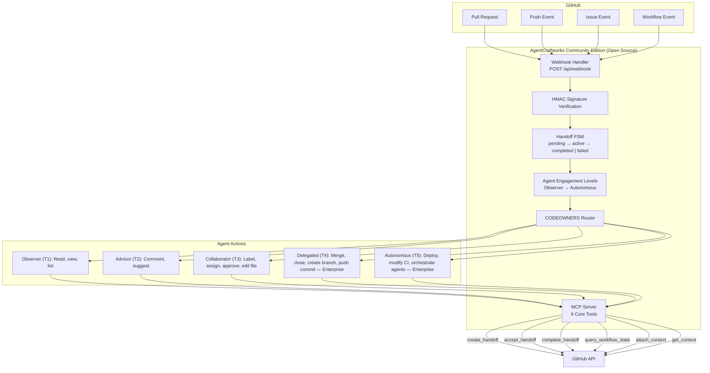
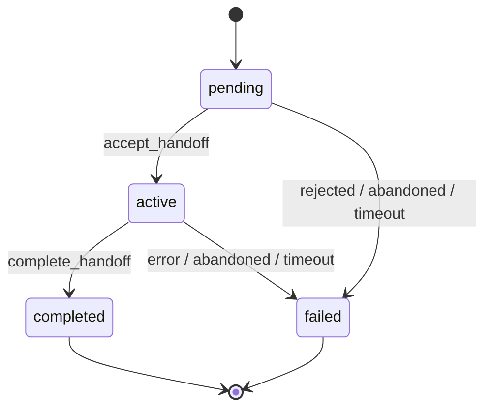

# AgentCraftworks Architecture

This document describes the full end-to-end architecture of AgentCraftworks — from GitHub events to agentic remediation.

## SDLC Lifecycle Context

Architecture decisions in this repository align to a staged SDLC strategy:

- Greenfield ideation and rapid prototyping
- Validation and staging hardening
- Productized promotion flow and governance
- Production operations and incident response

See `docs/SDLC_LIFECYCLE_STRATEGY.md` for the lifecycle model and when to activate stricter repo policy and infrastructure controls.

## Community Edition Architecture

## Handoff State Machine

Every agent handoff is a transition in a 4-state machine with two terminal states:

- Handoff IDs are UUIDs.
- `failed` always carries a reason prefix: `rejected:`, `abandoned:`, `error:` or `timeout:`.
- `overdue` is a **computed property**, not a stored state.

## MCP Tool Reference

| Tool | Description |
|---|---|
| `create_handoff` | Create a new agent handoff |
| `accept_handoff` | Accept a pending handoff |
| `complete_handoff` | Mark a handoff as completed |
| `query_workflow_state` | Query handoff state and history |
| `attach_context` | Attach structured context to a handoff |
| `get_context` | Retrieve context for a handoff |

## Agent Engagement Levels Reference

Community Edition supports levels 1–3 in every environment. Levels 4–5 require [AgentCraftworks Enterprise](https://agentcraftworks.com); see [ADR-CE-001](adr/ADR-CE-001-engagement-level-cap.md), which mirrors paid-product ADR-077.

| Level | Name | Action Tier | Permitted Actions | Human Required | Edition |
|---|---|---|---|---|---|
| 1 | Observer | T1 | Read, view, list | Always | CE |
| 2 | Advisor | T2 | Comment, suggest | Always | CE |
| 3 | Collaborator | T3 | Label, assign, approve, edit file | For merge | CE |
| 4 | Delegated | T4 | Merge, close, create branch, push commit | Escalation only | **Enterprise** |
| 5 | Autonomous | T5 | Deploy, modify CI, orchestrate agents | Never | **Enterprise** |

Environment caps — CE: maximum level 3 in every environment (`CE_MAX_LEVEL`); Enterprise raises the cap (staging 4 / production 3 by default). In CE, `setDialLevel` throws `EnterpriseLevelError` and `POST /api/dial/:owner/:repo` returns HTTP 422 with `code: "ENTERPRISE_REQUIRED"` for levels 4–5, whether requested numerically or by name (`delegated`, `autonomous`).