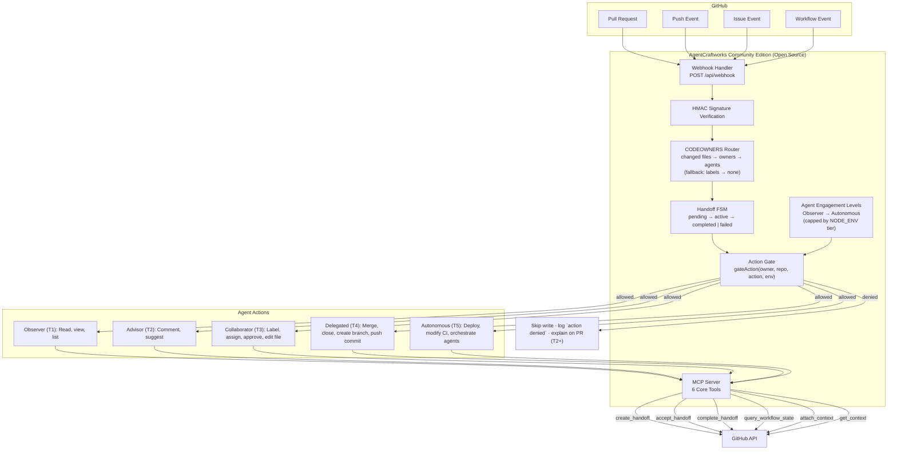
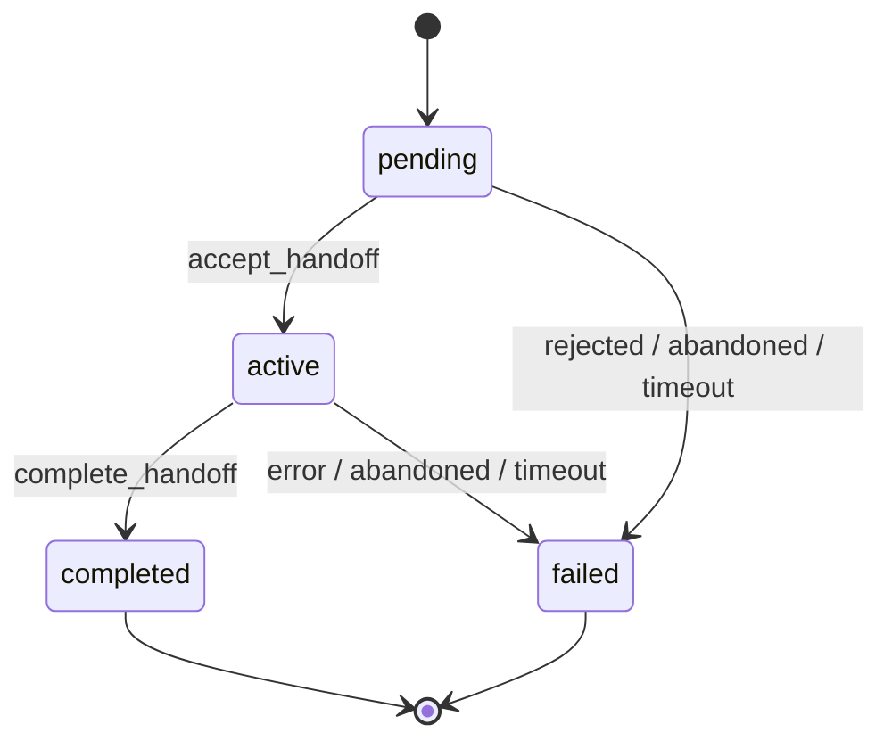

# AgentCraftworks Architecture

This document describes the full end-to-end architecture of AgentCraftworks — from GitHub events to agentic remediation.

## SDLC Lifecycle Context

Architecture decisions in this repository align to a staged SDLC strategy:

- Greenfield ideation and rapid prototyping
- Validation and staging hardening
- Productized promotion flow and governance
- Production operations and incident response

See `docs/SDLC_LIFECYCLE_STRATEGY.md` for the lifecycle model and when to activate stricter repo policy and infrastructure controls.

## Community Edition Architecture

### Pull request routing and gating

On `pull_request.opened | reopened | ready_for_review | synchronize | labeled`, the webhook handler
(`handlers/pull-request.ts`) performs the following steps:

1. **Load CODEOWNERS** — `services/codeowners-router.ts` fetches the first of
   `.github/CODEOWNERS`, `CODEOWNERS`, `docs/CODEOWNERS` via `GET /repos/{owner}/{repo}/contents/{path}`.
   The parsed result (including "not found") is cached per repository for 5 minutes.
2. **Fetch changed files** — `GET /repos/{owner}/{repo}/pulls/{n}/files`, paginated up to 300 files.
3. **Match** — `parseCodeowners()` + `matchFilesToTeams()` from `utils/codeowners.ts` produce the set of
   owners for the PR; each owner becomes an agent slug (`frontend-team` → `@frontend-team`).
4. **Create the handoff** — the primary agent receives the handoff; matched owners are stored in
   `handoff.teams` and the decision in `handoff.metadata.routing`.
5. **Gated writes** — every GitHub write goes through `services/action-gate.ts`:
   `add_label` (T2), `post_comment` (T2), and `request_review` (T4, CODEOWNERS routing only).
   Denied writes are skipped and logged as `{ msg: "action denied", ... }`; if the repository is at
   level 2 or higher, a single PR comment explains what was blocked and how to raise the level via
   `POST /api/dial/{owner}/{repo}`.

> **Routing precedence: CODEOWNERS → labels → none.**
> If no CODEOWNERS rule matches a changed file (or the file is absent), PR labels decide the agent
> (`security-review`, `accessibility-review`, `docs-review`, …). With neither, the handoff goes to
> `@code-reviewer` with `source: "none"`.

The environment tier used by the gate is derived from `NODE_ENV`: `production` → `production`,
`staging` → `staging`, anything else → `dev`. The tier caps the effective engagement level
(see table below), so a repository dialed to 5 is still limited to level 3 in production.

Without an installation ID and app credentials (`GH_CE_APP_ID`, `GH_CE_APP_PRIVATE_KEY`) the handler
cannot read CODEOWNERS or write to GitHub; it falls back to label routing and creates the handoff only.

## Handoff State Machine

Every agent handoff is a transition in a 4-state machine with two terminal states:

- Handoff IDs are UUIDs.
- `failed` always carries a reason prefix: `rejected:`, `abandoned:`, `error:` or `timeout:`.
- `overdue` is a **computed property**, not a stored state.

## MCP Tool Reference

| Tool | Description |
|---|---|
| `create_handoff` | Create a new agent handoff |
| `accept_handoff` | Accept a pending handoff |
| `complete_handoff` | Mark a handoff as completed |
| `query_workflow_state` | Query handoff state and history |
| `attach_context` | Attach structured context to a handoff |
| `get_context` | Retrieve context for a handoff |

## Agent Engagement Levels Reference

| Level | Name | Action Tier | Permitted Actions | Human Required |
|---|---|---|---|---|
| 1 | Observer | T1 | Read, view, list | Always |
| 2 | Advisor | T2 | Comment, suggest | Always |
| 3 | Collaborator | T3 | Label, assign, approve, edit file | For merge |
| 4 | Delegated | T4 | Merge, close, create branch, push commit | Escalation only |
| 5 | Autonomous | T5 | Deploy, modify CI, orchestrate agents | Never |

Environment caps: local=5, dev=5, staging=4, production=3